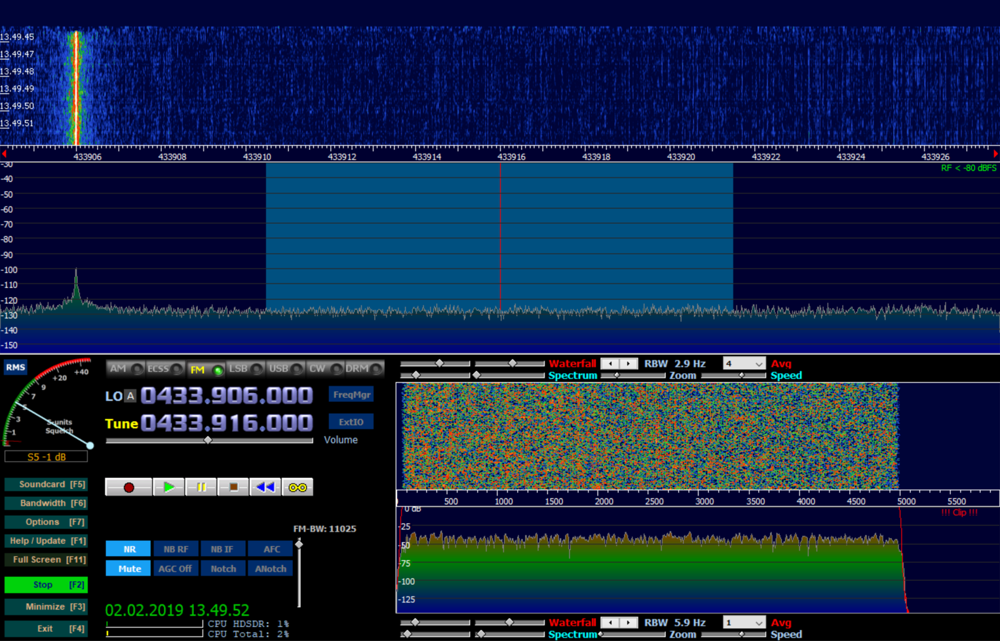
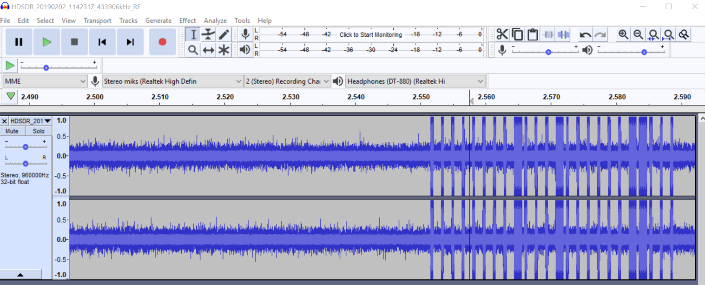
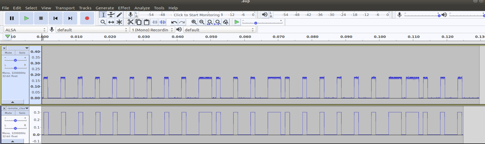

# RF_Projects
Integrating remote controlled devices into a smart home system using SDR

# Integrating Remote Controlled Devices into a Smart Home System Using SDR

## Table of Contents
- [Introduction](#introduction)
- [Prerequisites](#prerequisites)
- [Step-by-Step Guide](#step-by-step-guide)
  - [Step 1: Identify the Remote Control Frequency](#step-1-identify-the-remote-control-frequency)
  - [Step 2: Capture the Signal with an SDR](#step-2-capture-the-signal-with-an-sdr)
  - [Step 3: Analyze and Clean the Signal](#step-3-analyze-and-clean-the-signal)
  - [Step 4: Decode the Signal](#step-4-decode-the-signal)
  - [Step 5: Prepare Signal for Transmission](#step-5-prepare-signal-for-transmission)
  - [Step 6: Transmit the Signal](#step-6-transmit-the-signal)
  - [Step 7: Integrate with OpenHAB](#step-7-integrate-with-openhab)
  - [Step 8: Integrate with Home Assistant](#step-8-integrate-with-home-assistant)
- [Troubleshooting](#troubleshooting)
- [Safety Considerations](#safety-considerations)
- [Further Reading](#further-reading)
- [Contributing](#contributing)
- [License](#license)

## Introduction

This guide walks you through the process of reverse-engineering the signal from a remote-controlled device using a Software Defined Radio (SDR) and integrating it into your smart home system. By capturing, analyzing, and replicating the remote control signal, you can control various devices with your smart home setup. 

This process involves several tools, including GNU Radio Companion, HDSDR, Audacity, OOK Tools, and RfCat, with a focus on using the YardStick One as the SDR device.

## Prerequisites

- **Hardware**:
  - YardStick One or other SDR device (used for both capturing and transmitting RF signals)
- **Software**:
  - GNU Radio Companion and associated SDR software
  - HDSDR
  - Audacity
  - OOK Tools
  - RfCat
- **Knowledge**:
  - Basic understanding of radio frequency (RF) signals and modulation techniques
  - Familiarity with GNU Radio Companion, HDSDR, Audacity, and Python

## Step-by-Step Guide

## Installation

Before running the scripts, ensure you have all the necessary Python libraries and RfCat installed. You can install them using the provided script.

### Clone the repository
```bash
git clone https://github.com/A1Tman/RF_Projects
```

### Installation script:
```bash
chmod +x install_requirements.sh
```

### Step 1: Identify the Remote Control Frequency

1. **Locate the FCC ID**:
   - Look at the back of your remote control for the FCC ID.
   - Visit the [FCC ID Search website](https://www.fcc.gov/oet/ea/fccid) and enter the FCC ID to find detailed information about the device, including its operating frequency.

2. **Note the Frequency**:
   - Record the frequency range specified in the FCC documentation. This is the frequency you'll need to capture using your SDR.

### Step 2: Capture the Signal with an SDR

1. **Setup the SDR and Software**:
   - Connect your SDR device to your computer and launch GNU Radio Companion or HDSDR.
   - Configure the software to listen on the frequency you obtained from the FCC database.
   


2. **Capture the Signal**:
   - Press the remote control button while your SDR is recording.
   - Capture the signal waveform. It may take a few tries to get a clean capture, so repeat the process if necessary.
   
 

3. **Save the Signal**:
   - Export the captured signal to a file format compatible with Audacity or other audio processing tools (e.g., WAV).

### Step 3: Analyze and Clean the Signal

1. **Import the captured signal into Audacity**:
   - Open the captured signal file in Audacity.
   - Zoom in on the waveform to identify individual pulses. These represent the binary data being transmitted.
   

2. **Identify On-Off Keying (OOK) Modulation**:
   - Use Audacity to visualize the signal and identify the shortest pulse duration (this usually represents a binary '1').
   - Measure the duration of this pulse and identify the timing of longer pulses (which represent '0').

3. **Clean the Signal (optional)**:
   - Use OOK Tools (or similar) to clean up the signal by filtering noise and isolating the key signal.
   - Export the cleaned signal for further analysis.
   ```
   ooktools wave clean --source remote_.wav --destination remote_clean.wav
   ooktools wave binary --source remote_clean.wav
   ```

### Step 4: Decode the Signal

1. **Determine Pulse Width Modulation (PWM) Scheme**:
   - Analyze the signal to determine the PWM pattern.
   - For example, if you identify that a short pulse (e.g., 1000) represents '1' and a long pulse (e.g., 1100) represents '0', this is your PWM encoding scheme.

### Step 5: Prepare Signal for Transmission

1. **Convert Bitstring to Byte Array**:
   - Once you have the full bitstring, convert it into an 8-byte array that can be transmitted by RfCat.
   - Use the Python `bitstring` module to translate the binary sequence into a PWM key and byte array (or do it manually):
     ```python
     import bitstring

     key = '1111111110111011111100111'  # Example binary sequence
     pwm_key = ''.join(['1000' if b == '1' else '1110' for b in key])
     rf_data = bitstring.BitArray(bin=pwm_key).tobytes()

     print("Byte string: ", rf_data)
     print("PWM Key: ", pwm_key)

2. **Account for Signal Repetition**:
   - Determine how many times the remote control sends the signal in quick succession. This is typically done multiple times to ensure the device receives the command.
   - If necessary, pad the end of the byte array with zeros to account for timing delays between signals.

3. **Combine and Repeat**:
   - Concatenate the byte array multiple times, adding the required padding zeros between each repetition to match the original signal pattern.

### Step 6: Transmit the Signal

1. **Set Up RfCat**:
   - Plug in your compatible USB dongle (e.g., Yard Stick One) and configure RfCat to operate at the correct frequency.

2. **Transmit the Signal**:
   - Use RfCat to send the prepared byte array. Ensure that the transmission matches the original signal in terms of timing and frequency.

3. **Test**:
   - Test the transmission by attempting to control your device. Adjust the timing and repetition as needed to achieve reliable control.
   - Once you have generated the full PWM key, you can use the following Python script to transmit the signal using RfCat and the YardStick One:
    ```python
   #sonteremote.py
   import rflib
   import bitstring
   import time
   
   print("Welcome")
   
   # Prefix if present
   prefix = ''
   
   # Device's (static) binary key
   key = '11111111101110111111001111101111'
   
   # Converts to a PWM key
   # and replaces 1 with 1000 and 0
   # with 1110
   pwm_key = ''.join(['1000' if b == '1' else '1110' for b in key])
   
   # Join prefix and the rest of the data set for a complete PWM key
   full_pwm = '{}{}'.format(prefix, pwm_key)
   print("Full PWM key: {}".format(full_pwm))
   
   # Convert data to hex
   rf_data = bitstring.BitArray(bin=full_pwm).tobytes()
   
   # Start RfCat
   d = rflib.RfCat()
   
   # Set Modulation, in this case On-Off Keying
   d.setMdmModulation(rflib.MOD_ASK_OOK)
   
   # Configure YardStick One
   d.makePktFLEN(len(rf_data))  # Packet length
   d.setMdmDRate(2450)          # Baud Rate
   d.setMdmSyncMode(0)          # Disable preamble
   d.setFreq(433916000)         # Set frequency
   d.setMaxPower()              # Set max power
   
   # Send the data string a few times
   d.RFxmit(rf_data)
   
   # Set the unit to IDLE
   d.setModeIDLE()

## Step 7: Integrate with OpenHAB
To integrate the Python script that mimics a button press and sends a signal via the SDR (YardStick One) into OpenHAB:

#### 1. Install the Exec Binding:
- Open OpenHAB's Paper UI.
- Navigate to Add-ons > Bindings.
- Search for Exec and click Install.

#### 2. Create a new Thing in OpenHAB to run your Python script.
- Example '.things' configuration:
   ```openhab
   Thing exec:command:remotepress [command="/usr/bin/python3 /path/to/your/script.py", interval=0, timeout=5]
   ```

#### 3. Create an Item:
- Link an Item to the Thing created above. This Item will trigger the script.
- Example '.items' configuration:
   ```openhab
   Switch RemotePress "Remote Press" {channel="exec:command:remotepress:run"}
   ```

#### 4. Add to Sitemap:
- Add the Item to your sitemap so it can be controlled via the OpenHAB UI.
- Example '.sitemap' configuration:
   ```openhab
   sitemap demo label="Main Menu"
   {
       Switch item=RemotePress label="Press Remote Button"
   }

#### 5. Control via HABPanel or OpenHAB App:
- You can now control the remote button press via the OpenHAB app or HABPanel interface.

## Step 8: Integrate with Home Assistant

#### 1.<b> Define a shell command.</b>
- Add a shell_command to your configuration.yaml that will run your Python script.
<br>Example 'configuration.yaml' configuration:
  ```yaml
  shell command:
   press_remote_button: python3 /path/to/your/script.py
  ```
  
#### 2.<b> Create a Script:</b>
- Create a script that will call the shell_command defined above.<br>Example 'scripts.yaml' configuration:
  ```yaml
   press_remote:
     alias: "Press Remote Button"
     sequence:
       - service: shell_command.press_remote_button
   ```
#### 3. Add to Lovelace UI:
- Add a button to your Lovelace UI that triggers the script. <br>Example 'ui-lovelace.yaml' configuration:

   ```yaml
   type: entity-button
   entity: script.press_remote
   name: "Press Remote Button"
   ``` 

#### 4. Control via Home Assistant UI:
 - You can now trigger the remote button press via the Home Assistant interface.

## Troubleshooting

If you encounter issues during the process, try the following:

- Double-check the frequency and ensure your SDR is properly configured.
- Verify that your signal capture is clean and free from interference.
- Experiment with different pulse durations and repetition patterns.
- Consult the documentation for your specific SDR device and software tools.

## Safety Considerations

- Ensure you are complying with local laws and regulations regarding RF transmission.
- Be cautious when working with devices that control critical systems like heating or security.
- Always test your setup thoroughly before relying on it for automated control.

## Further Reading

- [Software-Defined Radio for Engineers](https://www.analog.com/en/education/education-library/software-defined-radio-for-engineers.html)
- [GNU Radio Tutorials](https://wiki.gnuradio.org/index.php/Tutorials)
- [Introduction to SDR and RTL-SDR](https://www.rtl-sdr.com/unknown-signal-reverse-engineering-and-decoding-afsk-signals-tutorial/)

## Contributing

Contributions to improve this guide are welcome. Please submit a pull request or open an issue to discuss proposed changes.

## License

This project is licensed under the MIT License - see the [LICENSE](LICENSE) file for details.
